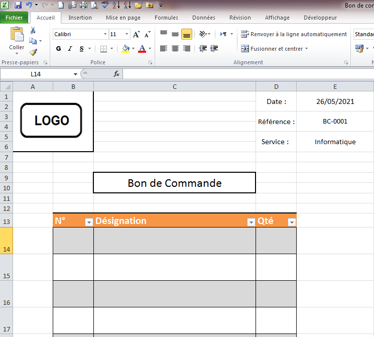
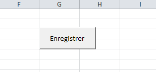
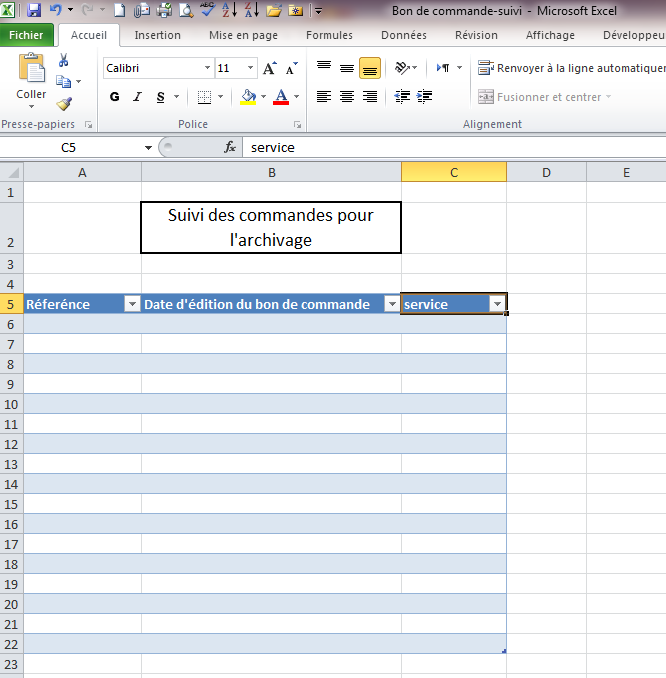
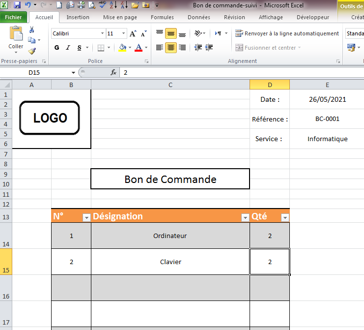
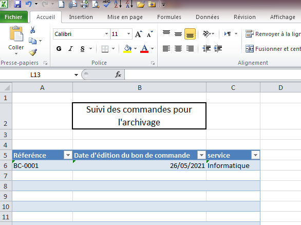

Dans un organisme, on a toujours besoin de réaliser d’une façon périodique des bons de commandes, chose qu’on fait habituellement d’une manière manuscrite. Comme ça on risque de perdre l’historique de ces demandes et on n’arrive pas à en faire un suivi.
C’est pour cette raison, je vous propose un Bon de commande sous format EXCEL simple que vous pouvez utiliser intra-service.

Ici vous avez 3 cellules et un tableau :
•	Date : pour saisir la date d’émission de la commande ici j’ai utilisé la formule « =AUJOURDHUI() »mais que vous pouvez effacer et la saisir manuellement.
•	Référence : pour indique le numéro de la commande
•	Service : le service qui a fait cette commande
•	Tableau : c’est pour définir le contenu de la commande.
Une fois vous avez élaboré la commande vous avez un bouton pour enregistrer la référence de la commande : 

Ces données sont enregistrés dans la feuille « suivi-commande ».

Exemple :

